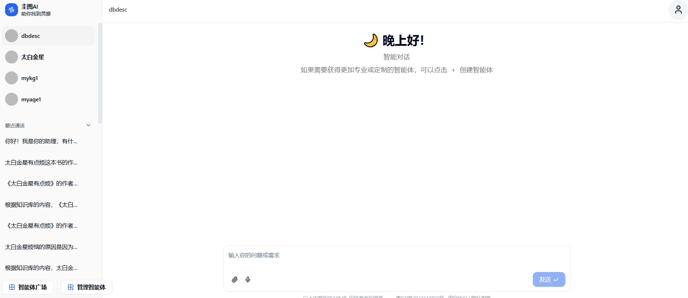
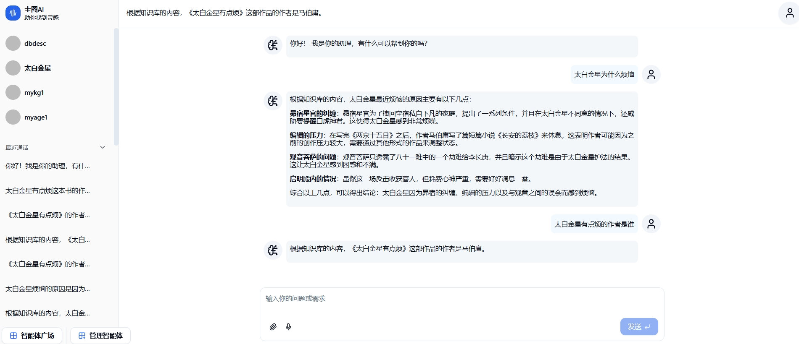
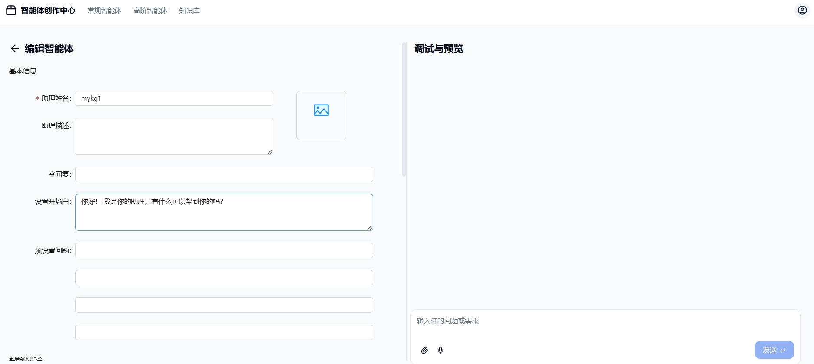
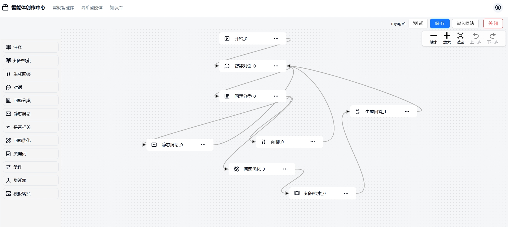
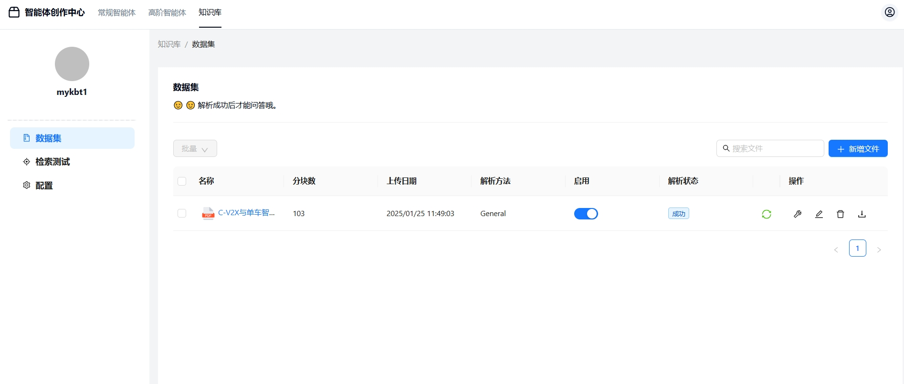
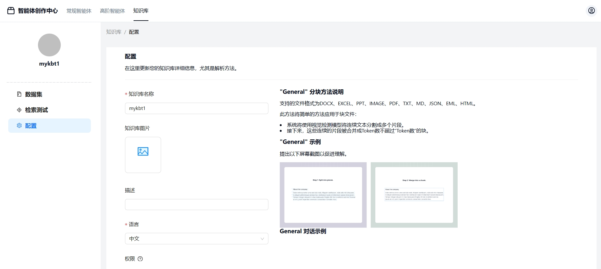

  <a href="./README.md">English</a> |
  <a href="./README_zh.md">简体中文</a> 

# GuiTuAI： A Java and Python-based LLM (Large Language Model) application development architecture that leverages Java's strengths in enterprise applications and Python's strengths in LLMs. By combining these two, it forms a low-code enterprise-grade framework for developing large model applications.

In today's rapidly evolving technological environment, enterprise application development is moving towards being more efficient, flexible, and easy to maintain. The LLM (Large Language Model) application development architecture based on Java and Python aims to fully leverage the unique advantages of both programming languages to provide enterprises with a powerful yet flexible low-code solution.

### Architecture Overview

This architecture uses Java as the core language for building an enterprise-grade business low-code platform, leveraging its stability, security, and robust ecosystem support. These features make Java an ideal choice for handling complex enterprise logic, data management, and server-side applications. Additionally, by utilizing Python's flexibility and efficiency in developing RAG (Retrieval-Augmented Generation) engines, especially for natural language processing tasks, it provides users with a more intelligent and intuitive interaction experience. By combining these two technologies effectively, we have created an LLM application development framework that is future-ready and capable of meeting the evolving needs of modern enterprises.

### Advantages

1. **High efficiency**：Java's stability and security ensure the solid foundation of enterprise-level applications, while Python accelerates the development cycle with its concise syntax and rich machine learning libraries, allowing developers to iterate on features more quickly while maintaining high quality standards.

2. **Intelligent user interaction**：Through the integration of a Python-driven RAG engine, this architecture can significantly enhance the understanding and response quality of the applications, enabling more natural and smooth human-machine dialogues, which greatly improves the user experience.

3. **Scalability**：This hybrid architecture allows enterprises to flexibly allocate resources and technology stacks based on their needs, whether it’s adding new business modules or expanding AI functionalities, it can be handled easily.

4. **Low cost**：By leveraging the concept of low-code platforms, it reduces the workload of writing repetitive code, improves development efficiency, and lowers the overall project cost. Additionally, since both Java and Python are open-source with large communities, it provides abundant resources and plugins, which further reduces the development time.

5. **Promote innovation**：Encouraging team members to explore new technologies while ensuring the stability of the existing system promotes sustained technological innovation, which helps the company stay ahead in competitive markets. 

## Code

### github

Frontend：[https://github.com/tu-160/guituai-agent-ui](https://github.com/tu-160/guituai-agent-ui)

backend：[https://github.com/tu-160/guituai-agent](https://github.com/tu-160/guituai-agent)

business low-code：[https://github.com/tu-160/guituai-cloud](https://github.com/tu-160/guituai-cloud)

### gitee

Frontend：[https://gitee.com/dabanzong/guituai-agent-ui](https://gitee.com/dabanzong/guituai-agent-ui)

backend：[https://gitee.com/dabanzong/guituai-agent](https://gitee.com/dabanzong/guituai-agent)

business low-code：[https://gitee.com/dabanzong/guituai-cloud](https://gitee.com/dabanzong/guituai-cloud)

## Technology stack

- Frontend：[Vue.js](https://cn.vuejs.org/)
- backend：[Spring Cloud/ Python](https://github.com/spring-projects/)
- Vector database：[elasticsearch](https://github.com/elastic/elasticsearch/)
- Cache database：[redis](https://github.com/redis/redis/)

### Integration (acknowledgment)
- [RAGFlow](https://github.com/infiniflow/ragflow): RAGFlow is an open-source RAG (Retrieval-Augmented Generation) engine based on deep document understanding.

## Business partnership
Based on the technology, we developed a commercial-grade software that supports proxy and private deployment!

Our advantages include custom industry solutions, support for user-defined agents, and leading technical solutions.

---

## Key features

### **"Quality in, quality out"**

- Deep document understanding-based knowledge extraction from unstructured data with complicated formats.
- Finds "needle in a data haystack" of literally unlimited tokens.

### **Template-based chunking**

- Intelligent and explainable.
- Plenty of template options to choose from.

### **Grounded citations with reduced hallucinations**

- Visualization of text chunking to allow human intervention.
- Quick view of the key references and traceable citations to support grounded answers.

### **Compatibility with heterogeneous data sources**

- Supports Word, slides, excel, txt, images, scanned copies, structured data, web pages, and more.

### **Automated and effortless RAG workflow**

- Streamlined RAG orchestration catered to both personal and large businesses.
- Configurable LLMs as well as embedding models.
- Multiple recall paired with fused re-ranking.
- Intuitive APIs for seamless integration with business.

### **Some system screenshots**

## Ecosystem support

### Large language model (supports mainstream 30+ language models)

| Name of the large language model                       | Support status   | Description    |
|-------------------------------|--------|-------|
| DeepSeek                       | ✅ Supported  | -     |
| MiniCPM                       | ✅ Supported  | -     |
| ChatGPT                       | ✅ Supported  | -     |
| Ollama                    | ✅ Supported  | -     |
| ChatGLM                    | ✅ Supported  | -     |
| Moonshot                 | ✅ Supported  | -     |
| Qwen2-7B-Instruct   | ✅ Supported  | -     |
| Qwen2-72B-Instruct  | ✅ Supported  | -     |
| Yi-1.5-34B-Chat     | ✅ Supported  | -     |
| glm-4-9b-chat       | ✅ Supported  | -     |

### Image generation model

| Name of the large language model                                      | Support status   | Description    |
|---------------------------------------------|--------|-------|
| Openai                                      | ✅ Supported  | -     |
| Stability                                   | ✅ Supported  | -     |
| stable-diffusion-3-medium         | ✅ Supported  | -     |
| FLUX.1-schnell                    | ✅ Supported  | -     |
| stable-diffusion-xl-base-1.0      | ✅ Supported  | -     |
| Kolors                            | ✅ Supported  | -     |
| Flux.1-schnell                | ✅ Supported  | -     |
| Stable Diffusion 3            | ✅ Supported  | -     |
| Stable Diffusion XL           | ✅ Supported  | -     |
| Stable Diffusion 2.1          | ✅ Supported  | -     |
| Stable Diffusion Turbo        | ✅ Supported  | -     |
| Stable Diffusion XL Turbo     | ✅ Supported  | -     |
| Stable Diffusion XL Lighting  | ✅ Supported  | -     |

### Multimodal

| Name of the large language model                     | Support status   | Description    |
|-----------------------------|--------|-------|
| DeepSeek                      | ✅ Supported  | -     |
| MimiCPM                      | ✅ Supported  | -     |
| Qwen                      | ✅ Supported  | -     |
| Openai                      | ✅ Supported  | -     |
| Ollama                      | ✅ Supported  | -     |

### Vectorization model

| Name of the large language model                     | Support status   | Description    |
|-----------------------------|--------|-------|
| Openai                      | ✅ Supported  | -     |
| bge-small-zh-v1.5 | ✅ Supported  | -     |
| bge-large-zh-v1.5 | ✅ Supported  | -     |
| bge-m3            | ✅ Supported  | -     |

